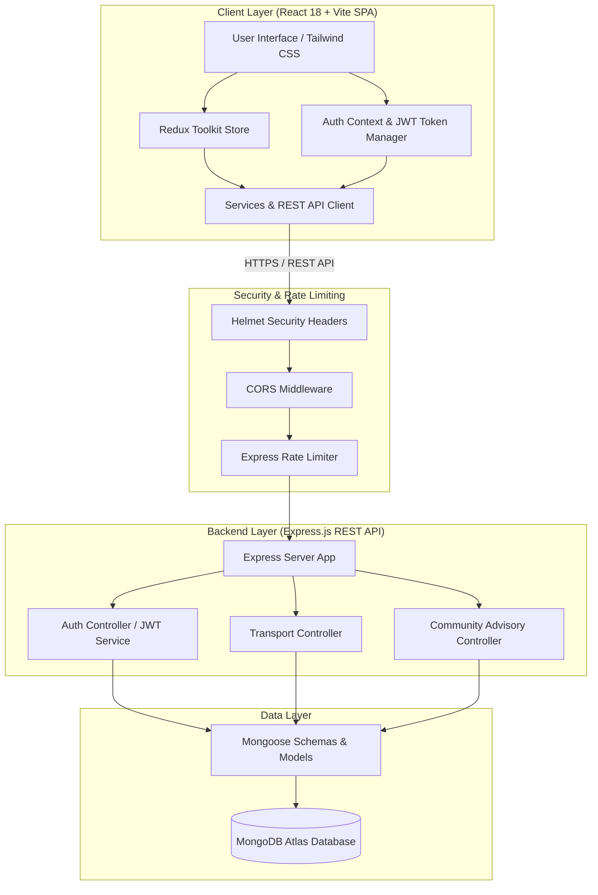
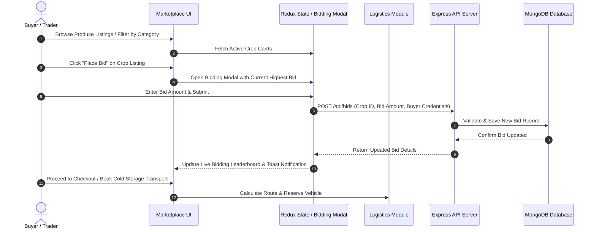
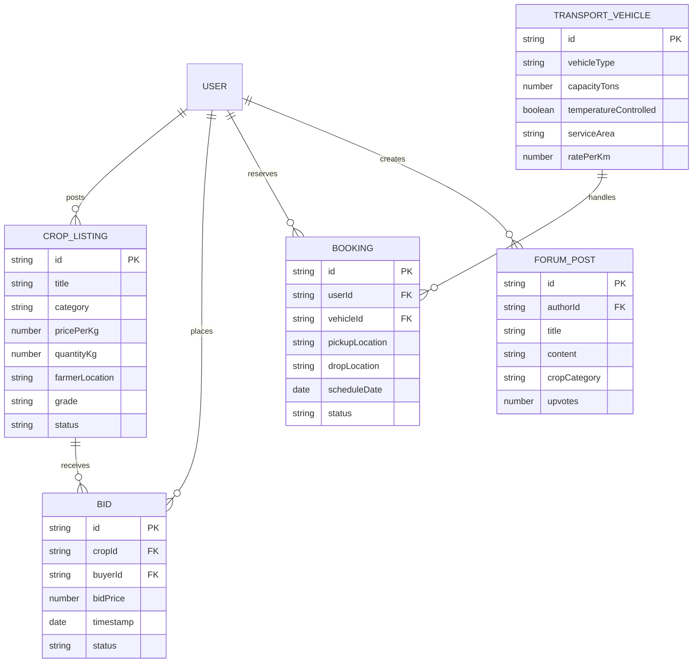

# KhetiConnect - Next-Gen Agri-Tech Marketplace & Logistics Platform

[](https://github.com/Jeet-827/BookSystem)
[](LICENSE)
[](https://reactjs.org/)
[](https://redux-toolkit.js.org/)
[](https://nodejs.org/)
[](https://www.mongodb.com/)
[](https://tailwindcss.com/)

KhetiConnect is a comprehensive, production-grade agricultural technology platform empowering farmers, agricultural buyers, logistics providers, and advisors. It bridges the gap between produce harvesting and marketplace distribution with real-time crop trading, live bidding, cold-chain logistics reservation, expert community advisory, and order processing.

---

## System Architecture & Flow Diagrams

### 1. High-Level System Architecture



---

### 2. User Marketplace & Bidding Flow Diagram



---

### 3. Entity-Relationship & Module Domain Diagram



---

## Key Features

### 1. Direct Agricultural Marketplace
- Direct farmer-to-buyer listing platform eliminating middleman margins.
- Categorized produce indexing (Grains, Vegetables, Fruits, Spices, Pulses).
- Quality grading standards (Grade A+, Organic, Standard) and interactive search filters.

### 2. Live Crop Bidding Engine
- Real-time bidding system for bulk crop auctions.
- Highest bid tracking, automated increment validation, and bid status updates.
- Countdown timers and instant notifications upon bid acceptance.

### 3. Cold-Chain & Freight Logistics
- Integrated transportation booking for farm-to-market dispatch.
- Temperature-monitored refrigerated transport and bulk logistics vehicles.
- Capacity indicators, route estimation, and cold storage warehouse space reservation.

### 4. Farmer Community & Advisory Hub
- Peer-to-peer knowledge sharing forum for pest control, crop yield tips, and weather advisories.
- Government subsidy guides, expert agronomist advisory posts, and Q&A threads.

### 5. Enterprise-Grade Authentication & Security
- Secure JWT-based authentication stored in HTTP-only cookies.
- Password hashing with bcryptjs (10 rounds).
- Express rate-limiting (stricter limit on auth routes) and HTTP header protection via Helmet.

---

## Technology Stack

| Domain | Technology | Description |
| :--- | :--- | :--- |
| **Frontend Framework** | React 18 + Vite 5 | Modern fast ES-module frontend build toolchain |
| **State Management** | Redux Toolkit | Centralized state store for marketplace, bids, and logistics |
| **UI & Styling** | Tailwind CSS + Lucide Icons | Responsive modern design system with glassmorphism & cards |
| **Charts & Analytics**| Recharts | Dynamic market price trends and crop volume analytics |
| **Backend Runtime** | Node.js (ES Modules) | High-performance asynchronous JavaScript engine |
| **API Framework** | Express 5 | Lightweight REST API framework |
| **Database** | MongoDB + Mongoose | Schema-driven document database |
| **Security & Auth** | JSON Web Tokens, bcryptjs, Helmet, CORS, Express-Rate-Limit | Multi-layered enterprise application security |

---

## Project Directory Structure

```
pbl/
├── index.html                  # HTML5 Entry Point
├── package.json                # Frontend Dependencies & Build Scripts
├── vite.config.js              # Vite Build Configuration & Chunk Splitting
├── tailwind.config.js          # Tailwind CSS Theme & Styling Config
├── postcss.config.js           # PostCSS Configuration
├── server/                     # Backend Express REST API Service
│   ├── index.js                # Server Entry Point & Global Middleware
│   ├── package.json            # Server Dependencies & Scripts
│   ├── config/
│   │   └── Mongodb.js          # Mongoose Database Connection Setup
│   ├── middleware/             # Auth Token Verification & Error Handlers
│   ├── models/                 # Mongoose Database Models (User, Transport, etc.)
│   └── routes/                 # API Endpoint Routers (auth.js, transport.js, etc.)
├── src/                        # React Frontend Source Code
│   ├── main.jsx                # React DOM Mount Entry
│   ├── App.jsx                 # Main Application Layout & Navigation
│   ├── index.css               # Global Styling System & Custom Utilities
│   ├── components/             # Reusable UI Components
│   │   ├── Marketplace.jsx     # Crop Listings & Auction Hub
│   │   ├── BiddingModal.jsx    # Live Bid Placement Interface
│   │   ├── Dashboard.jsx       # Analytics & Price Trend Charts
│   │   ├── TransportationSection.jsx # Freight & Cold Storage Booking
│   │   ├── CommunitySection.jsx# Advisory Forum & Q&A
│   │   ├── AddProductModal.jsx # Produce Listing Form
│   │   ├── PaymentModal.jsx    # Secure Checkout & Settlement
│   │   ├── Header.jsx          # Top Navigation Bar & User Controls
│   │   ├── Footer.jsx          # App Footer & Links
│   │   └── Toast.jsx           # Real-Time UI Notifications
│   ├── context/                # React Contexts (AuthContext)
│   ├── hooks/                  # Custom Hooks (useKheti)
│   ├── services/               # Token & API HTTP Services
│   └── store/                  # Redux Toolkit Slices & Store Config
└── README.md                   # Comprehensive Project Documentation
```

---

## Getting Started & Installation Guide

### Prerequisites
Make sure you have the following installed on your machine:
- **Node.js**: v18.0.0 or higher
- **npm**: v9.0.0 or higher
- **MongoDB**: Local MongoDB instance or MongoDB Atlas Connection URI

---

### Step 1: Clone the Repository
```bash
git clone https://github.com/Jeet-827/BookSystem.git
cd BookSystem
```

---

### Step 2: Install Dependencies

#### Install Frontend Dependencies
```bash
npm install
```

#### Install Backend Server Dependencies
```bash
cd server
npm install
cd ..
```

---

### Step 3: Configure Environment Variables

Create a `.env` file inside the `server/` directory:

```env
# server/.env
PORT=5000
NODE_ENV=development
MONGO_URI=mongodb://localhost:27017/kheticonnect
JWT_SECRET=your_super_secret_production_jwt_key_32_chars
JWT_EXPIRES_IN=7d
CORS_ORIGIN=http://localhost:3000
```

---

### Step 4: Run Application locally

#### Option A: Run Frontend Development Server
```bash
# In the project root directory:
npm run dev
```
The frontend will open at `http://localhost:3000` (or `http://localhost:5173`).

#### Option B: Run Express Backend Server
```bash
# In a new terminal window inside server/ directory:
cd server
npm run dev
```
The backend API server will start at `http://localhost:5000`.

---

## API Endpoints Summary

| Method | Endpoint | Description | Auth Required |
| :--- | :--- | :--- | :---: |
| `GET` | `/api/health` | Service health status check | No |
| `POST` | `/api/auth/register` | Register new farmer/buyer user | No |
| `POST` | `/api/auth/login` | Authenticate user & issue JWT cookie | No |
| `POST` | `/api/auth/logout` | Revoke session & clear cookies | No |
| `GET` | `/api/transport/vehicles` | List available freight & cold storage vehicles | No |
| `POST` | `/api/transport/book` | Reserve transport vehicle for produce cargo | Yes |
| `GET` | `/api/community/guides` | Fetch agronomist guides & advisories | No |
| `POST` | `/api/community/posts` | Create new community forum question | Yes |

---

## Production Build & Deployment

### Building Frontend Bundle
To build the optimized static asset bundle for production:
```bash
npm run build
```
This generates the minified production distribution in the `dist/` directory with code splitting.

### Deploying Frontend
- **Vercel / Netlify**: Connect your GitHub repository `Jeet-827/BookSystem`. Set build command to `npm run build` and output directory to `dist`.

### Deploying Backend
- **Render / Railway / Heroku**: Deploy the `server/` subdirectory. Set environment variables (`MONGO_URI`, `JWT_SECRET`, `NODE_ENV=production`) in the deployment dashboard.

---

## License
This project is licensed under the **MIT License** - see the [LICENSE](LICENSE) file for details.

---

<p align="center">
  Developed for the Agricultural Community | <strong>KhetiConnect Team</strong>
</p>
